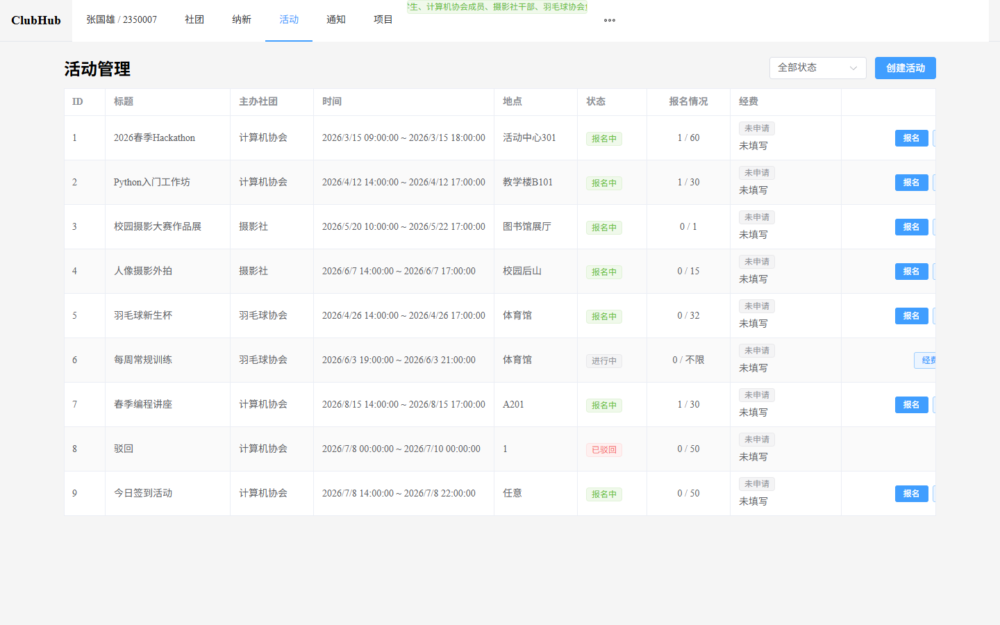
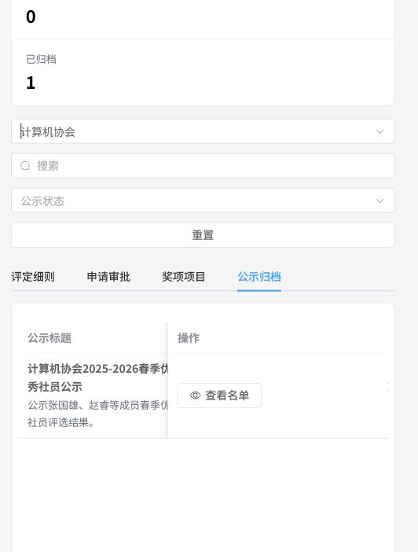
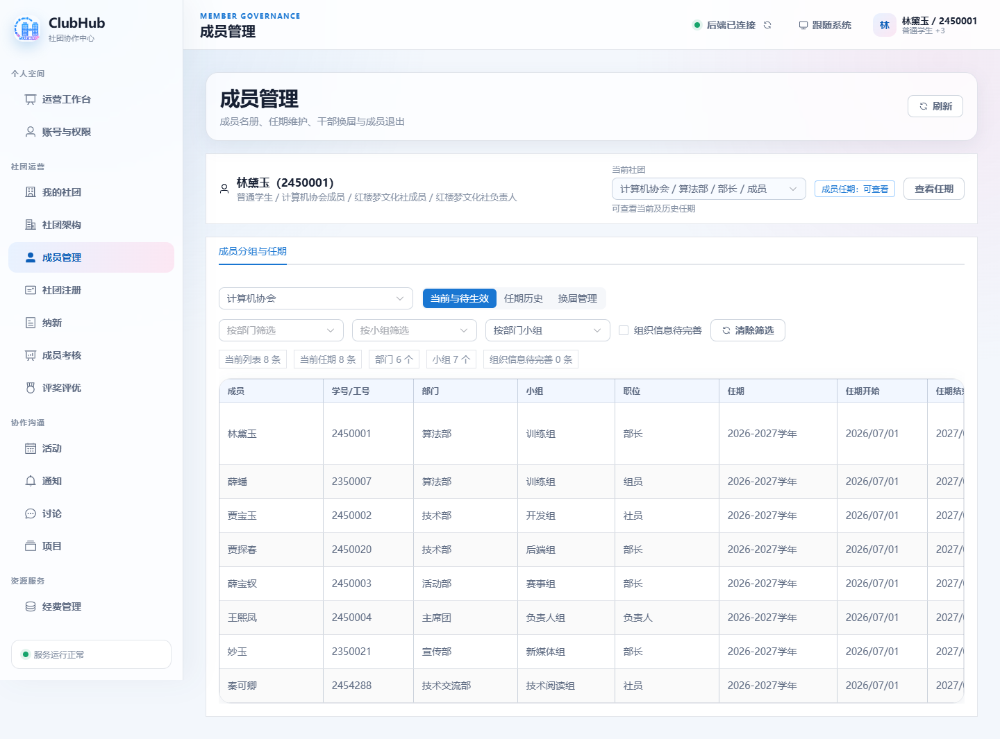

<p align="center">
  <!-- Logo 预留位置：后续如有正式品牌 Logo，可直接替换下方资源。 -->
  
</p>

<h1 align="center">ClubHub</h1>

<h3 align="center">高校社团运营与协同管理平台</h3>

<p align="center">
  <strong>同济大学 2026 年小学期 · 数据库课程设计</strong>
</p>

<p align="center">
  <a href="https://github.com/Palind-Rome/ClubHub/actions/workflows/ci.yml">
    
  </a>
  &nbsp;
  <a href="https://github.com/Palind-Rome/ClubHub/actions/workflows/code-check.yml">
    
  </a>
  &nbsp;
  
  &nbsp;
  
  &nbsp;
  
  &nbsp;
  
</p>

<p align="center">
  面向高校社团组织、成员、活动、项目与资源的一体化 B/S 协同平台。
</p>

## 项目简介

ClubHub 是同济大学《数据库课程设计》项目，围绕高校社团的日常运营场景，串联社团组织、成员招募、活动与场地、项目协作、课程资源、运营评价、公告通知和讨论区等业务。

项目采用 C# / Visual Studio / Oracle 技术路线，前后端分离实现 ASP.NET Core B/S 系统，便于多人协作、网页演示和后续部署。目前项目已完成课程交付，并获得“优”评定。

## 快速导航

- [核心能力](#核心能力)
- [项目展示](#项目展示)
- [技术栈](#技术栈)
- [目录结构](#目录结构)
- [课程要求摘要](#课程要求摘要)
- [协作与环境](#协作与环境)
- [自动化测试](#自动化测试)

## 核心能力

| 模块 | 覆盖内容 |
| --- | --- |
| 组织与成员 | 社团注册、组织架构、成员关系、干部换届与角色权限 |
| 招新与考核 | 社团招新、报名审核、成员考核与结果管理 |
| 活动与场地 | 活动发布、报名参与、签到、场地预约与冲突校验 |
| 经费与物资 | 预算申请、审批、收支记录、物资借用与归还 |
| 项目协作 | 项目成员、任务分配、进度汇报与协作跟踪 |
| 学习与资源 | 学习资料、培训内容、学习记录与资源借用 |
| 评优与公示 | 评奖方案、等级、申请审核、附件和结果公示 |
| 沟通与通知 | 公告通知、已读记录、论坛发帖与讨论互动 |

## 项目展示

<p align="center">
  
  
</p>

<p align="center">
  
</p>

<p align="center">
  <em>演示截图来自仓库内的项目素材，更多界面可在 <code>docs/images/</code> 与 <code>docs/screenshots/</code> 中查看。</em>
</p>

## 技术栈

| 层次 | 技术 |
| --- | --- |
| 开发环境 | Visual Studio Community 2022 或更高版本 |
| 后端 | C# / ASP.NET Core 10 Web API（目标框架 `net10.0`） |
| 前端 | Vue 3 / Vite / Element Plus |
| 数据库 | Oracle Database 18c 或更高版本 |
| 数据访问 | Oracle Managed Data Access / ODP.NET，必要时使用 Oracle EF Core Provider |
| 协作与交付 | GitHub Issues / Pull Requests / GitHub Actions |

## 目录结构

```text
.
├── .github/          # Issue 模板、PR 模板、CI 和部署 workflow
├── api/              # OpenAPI 规范文件，用于生成 API 客户端代码
├── backend/          # ASP.NET Core Web API
├── backend.Tests/    # 不连接远程 Oracle 的后端单元测试与 API 边界测试
├── backend.OracleIntegrationTests/ # 仅用于隔离 Oracle Schema 的专属集成测试
├── database/         # Oracle 建表脚本、种子数据、视图、迁移说明
├── docs/             # 课程交付文档
├── frontend/         # Vue 3 / Vite 前端
├── AGENTS.md         # 给 Agent 阅读的开发约定
├── CONTRIBUTING.md   # 协作说明
└── README.md
```

## 课程要求摘要

- 使用较新版本 VS.NET / Visual Studio。
- 使用 C#。
- 使用 Oracle 18c 或更高版本。
- 使用 Oracle 数据访问组件或 ORM 框架。
- 至少 12 张表，且符合第三范式。
- 至少 20 个功能点，其中至少 15 个必须有业务逻辑。
- 最终提交系统需求分析文档、数据库设计文档、系统设计与实现文档、答辩 PPT，并完成项目答辩和演示。

## 协作与环境

1. 阅读 `CONTRIBUTING.md`，确认环境、分支、提交、Issue、PR、CI/CD 和安全规范。
2. 配好 Visual Studio、.NET SDK 10.0、Oracle XE、SQL Developer。
3. 用 `database/schema.sql` 创建本地数据库结构，用 `database/verify.sql` 验证。
4. 日常开发先从 `dev` 分支开功能分支，用 Issue、PR 和 commit 留痕。

## 自动化测试

后端测试统一使用 xUnit。API 测试通过 `ClubHubWebApplicationFactory` 将正式 Oracle
`DbContext` 替换为进程内测试数据库，不读取或修改团队共享的远程 Oracle：

```powershell
dotnet test ClubHub.sln --configuration Release
```

前端使用 Vitest 和 jsdom，HTTP 请求使用 Mock，不依赖后端或数据库：

```powershell
cd frontend
pnpm install --frozen-lockfile
pnpm test
```

CI 会在相关目录发生变更时自动运行对应测试。需要验证 Oracle sequence、迁移脚本或
Oracle 特有查询时，应另行使用隔离的测试 Schema 或一次性数据库，禁止使用共享开发库。
`backend.OracleIntegrationTests` 默认跳过；只有同时提供
`CLUBHUB_ORACLE_INTEGRATION_CONNECTION` 和
`CLUBHUB_ORACLE_INTEGRATION_ISOLATED=true` 时才会执行，具体见该目录的 README。
